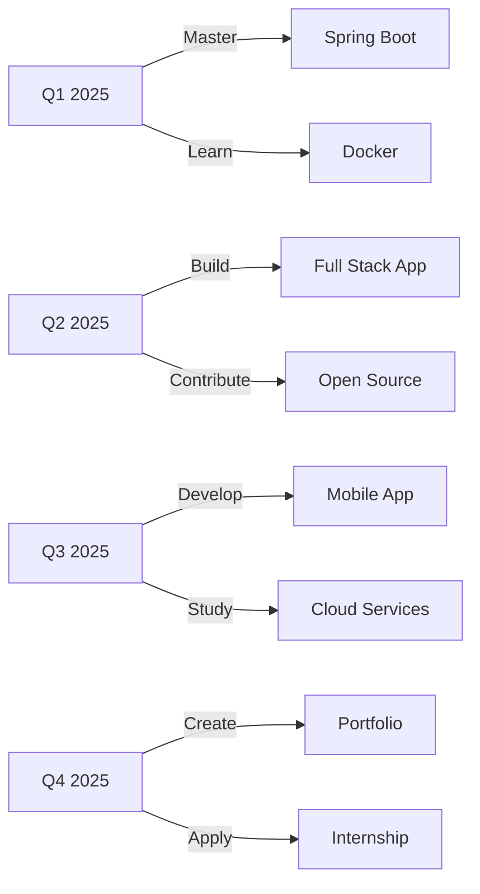

<!-- 🌟 Fahry Aditya Setiawan - Enhanced GitHub Profile 2025 -->

<!-- Animated Header -->
<div align="center">
  
</div>

<!-- Profile Section with Coding Animation -->
<div align="center">
  
</div>

<br/>

<div align="center">
  
</div>

<br/>

<!-- Social Badges -->
<div align="center">
  <a href="https://www.tiktok.com/@kitaxan">
    
  </a>
  <a href="https://www.instagram.com/takumaharuto?igsh=MWJzZmp6c2pyeGwyZQ==">
    
  </a>
  <a href="https://github.com/FahryAditya">
    
  </a>
  
</div>

<br/>


<!-- About Me Section with Coding Animation -->
<h2 align="center">🎯 About Me</h2>

<div align="center">
  
  
  <div align="left">
    
```yaml
name: Fads
alias: Haruxa
age: 17
education: SMK Student
location: Indonesia 🇮🇩
role: Programmer Robotika | Java Developer
passion: 
  - Coding & Innovation
  - Robotics & Automation
  - Clean Code Architecture
  - UI/UX Design
dream: Professional Software Engineer
motto: "Code is poetry written in logic"
```

  </div>
</div>

<br clear="both"/>

### 💡 What I Do

<div align="center">
  
| 🎯 Focus Area | 📝 Description |
|--------------|----------------|
| 🤖 **Robotics Programming** | Building intelligent automation systems |
| ☕ **Java Development** | Creating robust backend applications |
| 🎨 **UI/UX Design** | Crafting beautiful user experiences |
| 🧩 **Problem Solving** | Turning complex challenges into elegant solutions |
| 🌐 **Full Stack** | Exploring modern web technologies |

</div>

### 🌱 Currently Learning

<div align="center">
  
```javascript
const currentlyLearning = {
  backend: ["Spring Boot", "Microservices Architecture"],
  database: ["MySQL Optimization", "PostgreSQL"],
  api: ["RESTful API Design", "API Integration"],
  mobile: ["Flutter", "Cross-Platform Development"],
  principles: ["Design Patterns", "Clean Code"]
};
```

</div>


<!-- Achievements Section -->
<h2 align="center">🏆 Achievements & Milestones</h2>

<div align="center">
  
  
  
</div>

<div align="center">
  <table>
    <tr>
      <td align="center" width="25%">
        <br/>
        <b>4+ Projects</b><br/>
        <sub>Database Integrated Apps</sub>
      </td>
      <td align="center" width="25%">
        <br/>
        <b>Logic Games</b><br/>
        <sub>CLI Problem Solving Tools</sub>
      </td>
      <td align="center" width="25%">
        <br/>
        <b>Exploring</b><br/>
        <sub>Modern Architecture</sub>
      </td>
      <td align="center" width="25%">
        <br/>
        <b>UI/UX</b><br/>
        <sub>Mobile Prototypes</sub>
      </td>
    </tr>
  </table>
</div>


<!-- Tech Stack Section -->
<h2 align="center">🛠️ Tech Arsenal</h2>

<div align="center">
  
</div>

### 💻 Languages & Frameworks
<div align="center">
  
</div>

### 🌐 Web Technologies
<div align="center">
  
</div>

### 🗄️ Databases & Tools
<div align="center">
  
</div>

### 🔧 Hardware & Robotics
<div align="center">
  
  
</div>


<!-- GitHub Stats -->
<h2 align="center">📊 GitHub Analytics</h2>

<div align="center">
  
  
</div>

<div align="center">
  
</div>

<!-- Contribution Graph -->
<div align="center">
  
</div>

<!-- Trophy Display -->
<div align="center">
  
</div>


<!-- Featured Projects -->
<h2 align="center">📁 Featured Projects</h2>

<div align="center">
  
</div>

<div align="center">
  
| 🎯 Category | 📊 Count | 🔥 Status |
|------------|---------|----------|
| ☕ Java Projects | 4 |  |
| 🌐 Web Projects | 3 |  |
| 🖥️ CLI Tools | 2 |  |
| 🤖 Robotics | 5 |  |
| 📱 Mobile Apps | 2 |  |

</div>

<details>
<summary><b>🎮 Java Game Engine</b> - Interactive CLI Game Framework</summary>
<br/>

- 🎯 Turn-based game logic with OOP principles
- 💾 Save/Load system with serialization
- 🎨 ASCII art rendering engine
- 🔧 **Tech Stack:** Java, File I/O, Data Structures

</details>

<details>
<summary><b>🌐 Personal Portfolio Website</b> - Modern Responsive Design</summary>
<br/>

- ⚡ Fast loading with optimized assets
- 📱 Mobile-first responsive design
- 🎨 Dark/Light mode toggle
- 🔧 **Tech Stack:** HTML, CSS, JavaScript, Tailwind

</details>

<details>
<summary><b>🤖 Arduino Line Follower</b> - Autonomous Robot</summary>
<br/>

- 🔬 PID control algorithm implementation
- 📡 IR sensor array integration
- ⚙️ Motor speed optimization
- 🔧 **Tech Stack:** Arduino, C++, Electronics

</details>


<!-- Roadmap Section -->
<h2 align="center">🎯 2025 Goals & Roadmap</h2>

<div align="center">
  
</div>



### 📋 Progress Tracker

- [x] Complete Spring Boot basics
- [x] Build REST API with authentication
- [ ] Deploy app to cloud platform
- [ ] Contribute to 3 open-source projects
- [ ] Master Flutter development
- [ ] Build production-ready portfolio


<!-- Daily Quote -->
<h2 align="center">💬 Daily Dev Quote</h2>

<div align="center">
  
</div>


<!-- Coding Soundtrack -->
<h2 align="center">🎵 Coding Soundtrack</h2>

<div align="center">
  
</div>

<div align="center">
  
</div>

### 🎧 Current Playlist

<div align="center">
  <table>
    <tr>
      <td align="center" width="200">
        <br/>
        <b>🎵 Umapyoi Densetsu</b><br/>
        <sub>Uma Musume</sub>
      </td>
      <td align="center" width="200">
        <br/>
        <b>🎵 Tracen Ondo</b><br/>
        <sub>Uma Musume: Pretty Derby</sub>
      </td>
      <td align="center" width="200">
        <br/>
        <b>🎵 Otsukare Summer</b><br/>
        <sub>HALCALI</sub>
      </td>
    </tr>
    <tr>
      <td align="center">
        <br/>
        <b>🎵 Please Please</b><br/>
        <sub>Ayaka Osashi</sub>
      </td>
      <td align="center">
        <br/>
        <b>🎵 Grand Escape</b><br/>
        <sub>Radwimps</sub>
      </td>
      <td align="center">
        <br/>
        <b>🎵 Winning the Seoul</b><br/>
        <sub>Oguri Cap</sub>
      </td>
    </tr>
  </table>
</div>


<!-- Weekly Breakdown -->
<h2 align="center">📊 Weekly Development Breakdown</h2>

<div align="center">
  
</div>

```text
Java         12 hrs 30 mins  ████████████░░░░░░░░░  48.2%
HTML/CSS      5 hrs 15 mins  ████░░░░░░░░░░░░░░░░░  20.3%
JavaScript    4 hrs 20 mins  ███░░░░░░░░░░░░░░░░░░  16.8%
Arduino       2 hrs 45 mins  ██░░░░░░░░░░░░░░░░░░░  10.6%
Others        1 hr 5 mins    █░░░░░░░░░░░░░░░░░░░░   4.1%
```


<!-- Connect Section -->
<h2 align="center">🤝 Let's Connect & Collaborate!</h2>

<div align="center">
  
</div>

<div align="center">
  <a href="https://www.tiktok.com/@ryu.kitasan?_r=1&_t=ZS-93HcLucUWer">
    
  </a>
  <a href="https://www.instagram.com/takumaharuto?igsh=MWJzZmp6c2pyeGwyZQ==">
    
  </a>
  <a href="https://github.com/FahryAditya">
    
  </a>
</div>

<br/>

<div align="center">
  
  
  
</div>


<!-- Support Section -->
<h2 align="center">🌟 Support My Journey</h2>

<div align="center">
  <a href="https://github.com/FahryAditya">
    
  </a>
  <a href="https://github.com/FahryAditya?tab=repositories">
    
  </a>
</div>

<br/>

<div align="center">
  <i>⭐ Star my repositories if you find them useful!</i><br/>
  <i>🔔 Follow for updates on new projects!</i><br/>
  <i>💡 Feel free to reach out for collaboration!</i>
</div>


<!-- Snake Animation -->
<div align="center">
  
</div>


<!-- Coding GIF -->
<div align="center">
  
</div>

<!-- Footer Wave -->
<div align="center">
  
</div>

<div align="center">
  <sub>Made with 💙 by Haruxa| Last Updated: January 2026</sub><br/>
  <sub>© 2026 Fahry Aditya Setiawan. All Rights Reserved.</sub>
</div>

<!-- Visitor Count -->
<div align="center">
  
</div>
